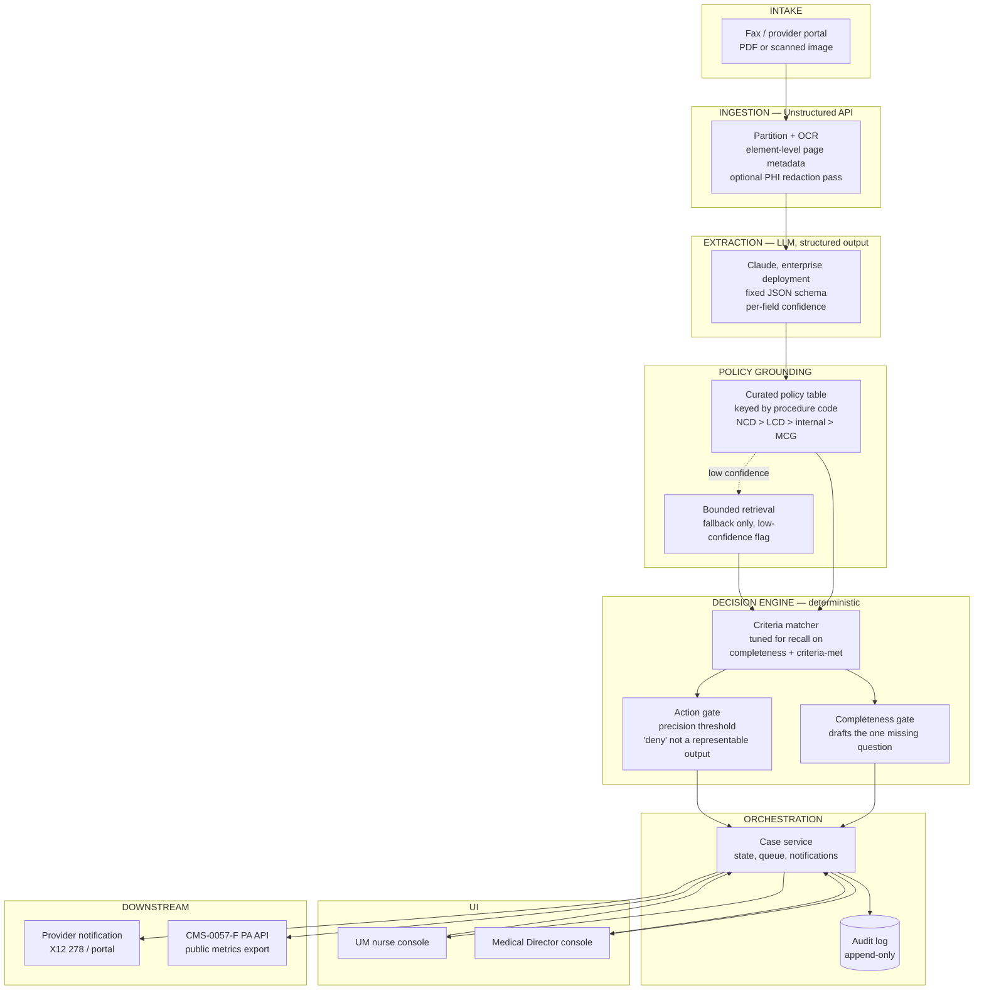

# Architecture — Prior Authorization Decision Support

This describes the production system the take-home prototype stands in for. The
prototype (`/prototype/pa-console.html`) is a browser-only demo: a regex engine
plays the part of the model call, because the demo sandbox cannot make live
API calls. Everything below is what actually ships.

Read alongside `docs/NOTES.md` (the decision log) and the deck
(`deck/Humana_PA_Deck.pptx`), which this document assumes as the PRD.

---

## 1. The one thing to get right first

**Ingestion (turning a fax into text) and reasoning (deciding what that text
means) are two different systems, built and evaluated separately.** Conflating
them is the most common mistake in this category of product — a "smart PDF
reader" that quietly makes clinical judgments, or a clinical reasoning layer
that also has to solve OCR. Neither should happen in the same service.

| Layer | Job | Gets it wrong how |
|---|---|---|
| Ingestion | Turn a scanned fax into structured, page-cited text | Garbles a table, mis-OCRs a number |
| Extraction | Pull the four facts UM needs, from that text | Misses that a fact is present, or hallucinates one that isn't |
| Policy grounding | Know which policy applies, and what it requires | Applies the wrong policy version, or an expired one |
| Decision | Turn facts + policy into a checklist and a recommendation | Treats every error the same, or lets the model deny |

Four different failure modes, four different places to catch them. The
architecture below is organized around that separation.

---

## 2. System diagram



---

## 3. Ingestion — Unstructured API

This is the layer you asked about directly, so worth being precise: **it does
one job, and it's not a small one.**

- Input: the fax/portal PDF, image, or scan.
- Unstructured partitions it into elements — titles, narrative text, tables —
  running OCR automatically (`hi_res` / VLM strategy) when the source is a
  scanned image, which a fax almost always is.
- Every element keeps its page number as metadata. **This is where "p. 6 of
  14" comes from in production** — it is not something the extraction step
  invents, it is carried forward from ingestion. That directly satisfies the
  auditability NFR at the layer where it is cheapest to guarantee.
- Unstructured also runs PII/PHI detection and redaction as a pipeline step,
  which matters here specifically: anything downstream of ingestion that
  touches logging, analytics, or the eval set should see redacted text, not
  raw member data.

**What it does not do, and this is the point you made:** it has no idea what
a length of stay is, or that heart failure raises peri-operative risk. It
hands you clean, page-cited text. The next layer is where the actual clinical
reasoning happens.

**Constraint that has to be named out loud:** the free public API is fine for
this take-home's fictional packets. Real member documents require
Unstructured's enterprise or self-hosted offering under a signed BAA — the
free tier is not a HIPAA-eligible service. Same logic applies to the model
provider in the next section.

---

## 4. Extraction — where the actual AI work happens

A model call (Claude, via an enterprise deployment covered by a BAA — Bedrock
or a direct enterprise agreement, never the consumer API) takes the
Unstructured output and returns a **fixed JSON schema**, not free text:

```json
{
  "procedure": { "value": "...", "source_page": 2, "confidence": "high" },
  "requested_setting": { "value": "inpatient", "source_page": 2, "confidence": "high" },
  "comorbidities": [
    { "value": "Heart failure (EF 40%)", "source_page": 6, "confidence": "high" }
  ],
  "expected_los_days": { "value": null, "source_page": 6, "confidence": "uncertain",
    "note": "Surgeon notes a multi-day stay; no specific duration stated." },
  "post_op_monitoring": { "value": true, "source_page": 6, "confidence": "high" }
}
```

Three things about this schema are load-bearing, not incidental:

1. **Every field carries a source page**, inherited from Unstructured's
   metadata, so a citation is structurally required, not something a prompt
   has to remember to add.
2. **Every field carries a confidence value, and `"uncertain"` is a real,
   first-class value** — not a low number the UI has to interpret. This is
   the FR from the deck (D-007): the extraction step is tuned and evaluated
   for **recall** — a missed fact or missed piece of supporting evidence is
   the expensive error, an over-flagged one costs a follow-up question. Don't
   let this collapse into a single accuracy number; it gets evaluated as two
   separate metrics (did we find the field when it was there, did we avoid
   inventing it when it wasn't).
3. **This schema is versioned.** Same input, same schema version, same shape
   of output — that's the reproducibility NFR, and it's also what makes an
   eval set possible: you can't score outputs you can't diff.

---

## 5. Policy grounding — deliberately not a general RAG search

The instinct is to build retrieval over the whole NCD/LCD corpus. Don't,
at least not first.

The policy that applies to a given request is a **known, bounded fact** the
moment you have a procedure code — it's not something to search for, it's
something to look up. So:

- **A curated policy table**, keyed by procedure/service code, maintained by
  the Utilization Management Committee — the same committee CMS-4201-F
  already requires every MA plan to run annually to keep policies consistent
  with Traditional Medicare. This is the artifact that encodes the hierarchy
  (an NCD entry wins over an LCD entry, which wins over Humana's own policy,
  which wins over MCG) as **data**, not as something an LLM has to remember
  to respect on every call.
- **A bounded retrieval fallback**, used only when the procedure code has no
  curated entry yet. Its output is always flagged low-confidence and routed
  to a human to select the applicable policy — it never silently substitutes
  for the curated table.

This is the more defensible design for a regulated decision, and it's a
smaller build than it sounds: the curated table covers the common inpatient
admissions by volume on day one; the fallback path exists so nothing hard-
fails, but it isn't where the weight of the system sits.

---

## 6. Decision engine — deterministic, on purpose

The criteria matcher and the two gates (completeness, action) are **plain
code, not a second model call.** Three reasons, all from the FR/NFR set:

- **Auditability.** "This recommendation cites LCD L38795" has to be true
  every time, not true-with-high-probability. A rules engine can guarantee
  that; a second LLM call can't.
- **The hierarchy is a legal constraint** (CMS-4201-F: MA plans may not let
  MCG or InterQual override an NCD or LCD). Encoding "NCD beats MCG" as an
  `if` statement makes it unconditionally true. Encoding it as a prompt
  instruction makes it usually true.
- **Reproducibility.** Same facts, same policy version, same criteria
  result, forever — which is exactly what an auditor asks for.

The two gates from the FR slide map directly to code, not conventions:

- **Completeness gate** — fires when any extracted field has
  `confidence: "uncertain"`. Drafts the one missing question from the
  specific field that's uncertain (this is the `GATE_Q` lookup in the
  prototype, carried forward unchanged).
- **Action gate** — separate, stricter threshold before the system may
  *recommend* approve. High recall on detection, higher precision bar before
  acting on it. Two different knobs on two different steps in the pipeline,
  not one blended confidence score.

**The strongest version of "the AI never denies":** don't enforce it with a
missing button in the UI. Enforce it in the type. The decision engine's
output enum is `{ approve, escalate }` — `deny` does not exist as a value
this system can produce. A UI bug can hide a button. It can't call a
function with a value that doesn't exist in the schema.

---

## 7. Orchestration, UI, audit

- **Case service** owns state (pend → ready → escalated → approved/denied),
  the queue, and notifications back to the provider (X12 278 response, or
  the CMS-0057-F Prior Authorization API once that's live in production —
  same event, two output formats).
- **Audit log** is append-only: every extraction, every criteria match,
  every human action, timestamped. This is the system of record for the
  CMS-0057-F annual public reporting requirement and for anything that ever
  gets reviewed the way the OIG reviewed the SNF denials in the deck.
- **UI** is the nurse and Medical Director consoles — the prototype's
  interaction model carries forward unchanged; only what's behind it
  changes, from a client-side array to real API calls against the case
  service.

---

## 8. What's real today vs. what the prototype stands in for

| In the prototype | In production |
|---|---|
| Hardcoded `documents[].text` | Unstructured API output, from a real uploaded fax/PDF |
| Regex extraction (`extractFromDoc`) | Claude structured-output call, evaluated on a labeled set |
| Hardcoded `CRIT` policy object | Curated policy table, versioned, owned by the UM Committee |
| `analyzeCase()` criteria matcher | Same logic, same shape — this part barely changes |
| In-memory JS `cases` array | Case service + database, audit log store |
| Nothing (browser only) | BAA-covered model and ingestion deployment, real PHI boundary |

That last row is the one to say out loud if asked: the interaction model,
the decision logic, and the gates are all real design decisions already made
correctly. What's missing between this prototype and production is
infrastructure and a signed BAA, not product judgment.

---

## 9. Build sequencing

Matches Phase 1 / Phase 2 from the deck's Scope & Phasing slide.

**Phase 1 (Managed):** Unstructured ingestion → Claude extraction → curated
policy lookup → deterministic criteria engine → nurse console,
recommend-only → audit log. Ships the completeness gate. Targets avoidable
pend rate and first-pass determination rate.

**Phase 2 (Intelligent):** gated auto-approve on the highest-confidence
subset, once the eval set proves zero false approvals. A feedback loop from
denial and appeal outcomes back into the extraction eval set. Member-facing
status via the 2027 Patient Access API.

---

## What I'd need to actually build this, not just describe it

- **A GitHub remote.** This repo is initialized locally with everything
  organized (`/prototype`, `/deck`, `/docs`). I don't have `gh` CLI access
  in this environment to create the remote for you — create an empty repo
  on github.com, and I can add it as `origin` and push, or hand you the two
  commands to do it yourself.
- **A decision on how far to wire this for real.** This document is enough
  to defend the architecture in the room as-is. If you want an actual live
  call to Unstructured's free API against one of the three sample packets
  (not inside the browser demo — that sandbox blocks external calls — but as
  a local Node script you run and I build), that's a half-day of real work,
  not a redesign, and it would let you show one genuine extraction result
  alongside the prototype rather than only describing the layer.
